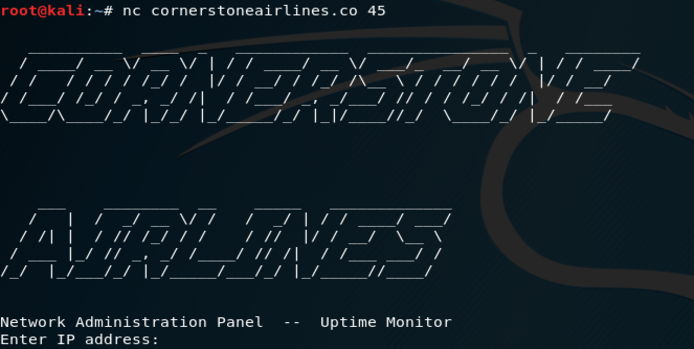
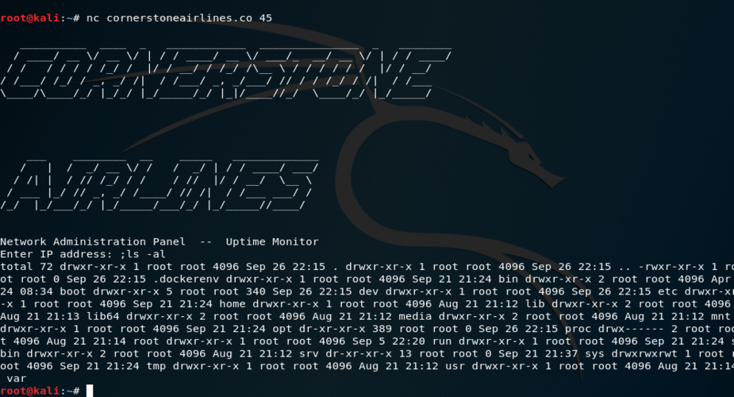
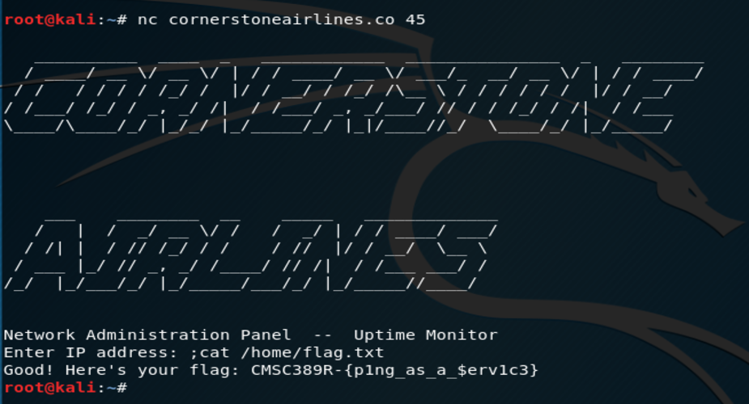

Writeup 3 - Pentesting I
======

Name: *Kate Mann*
Section: *0101*

I pledge on my honor that I have not given or received any unauthorized assistance on this assignment or examination.

Digital acknowledgement of honor pledge: *Kate Mann*

## Assignment 4 Writeup

### Part 1 (45 pts)
* Flag: CMSC389R-{p1ng_as_a_$erv1c3}

#### Initial Steps
The first course of action was to get a copy of the lecture slides from the repository. The slides helped determine 
which tools would most likely be needed with this weeks assignment. I then began to explore them to determine how 
best to use them. From there, I created a plan of attack for this problem. Then it was time to explore the 
command `nc cornerstoneairlines.co 45` to determine what happened occurs when connecting to that port. From there, 
it was time to start trying different inputs to the prompt. 

 
#### Attack Vector Discovery
After completing this step, I decided to start with Mitre's CVE list. I began by searching 
`linux ping AND command injection` which returned 42 results. I then went through each result to determine if it 
provided a viable attack vector for this assignment. For the CVEs that contained references I would follow the link
and determine if there was an attack or description of attack that I could search for on github or google. I continued 
this process until I reached `CVE-2017-1000473`. The reference inside of this 
[CVE](https://github.com/afaqurk/linux-dash/issues/447) lead to a github issue discussing the command injection 
vulnerabilities for linux-dash. I copied and pasted the command injection line `;ls -al` fdcarl used on 
the issue in place of an IP address on cornerstoneairlines.co port 45. This immediately listed out the entire 
directory listing under the root directory. Attack success! 

#### Finding the Flag
After determining the attack vector was indeed the correct one, I then began to dig around inside the directories
to find the correct flag by using `;cd directory name && ls -a`. After searching around for a while I finally landed in 
the home directory which contained only the file `flag.txt`. From there, I then executed the command
`cat /home/flag.txt` to get the print out of the correct flag. 

#### Discovery of the Vulnerable Script
After digging around the server for a while, I stumbled upon `container_startup.sh` in the opt directory. Within this 
script the actual vulnerability was discovered. In the script, the linux ping command is being directly called
with the arguments and command line input `ping -w 5 -c 2 $input`. Because there is no separation between the command 
and the input, a malicious semicolon will allow for command injection. 

#### How to protect system from this vulnerability
Sanitize User Input: User input should never be blindly trusted. Since it is easy to explore the entire root 
directory by using command injection it is important to ensure that input from the users are properly sanitized. 
Ideally this input would be checked and sanitized directly after the input is received but it should always be 
validated and sanitized before it is used. Commonly, it is easier to create a whitelist for validation of user input. 
This list will check the input against what input characters and numbers are allowed and if any
input is received containing characters not in the list will automatically be ignored. 

Don't Treat Input as Code: The ping command execution does not correctly parametrize the input. If available, 
the script should call a built in function to call the command rather than having the script do it by itself. 
Most built in functions do basic parametrization to ensure the input data is completely separated from the code 
and therefore will not be executable. 

#### Sources
* 1: [OWASP](https://www.owasp.org/index.php/Input_Validation_Cheat_Sheet#Goals_of_Input_Validation)

### Part 2 (55 pts)

The first thing that was completed inside stub.py was to add the socket connection to Cornerstone Airlines. 
After finishing that, I then researched how to create a command shell using Python. This led me to the Cmd
library page for Python. I also googled for some examples on how to use this library to implement a lasting shell. 
Then I created the initial program shell which starts when the program is ran. Then it was time to  work on the various 
commands this shell must implement. 

This initial shell only implements the commands shell, quit, help, and pull. Luckily, the help command was already
included in the Cmd library so I did not have to actually implement it myself. The hardest command to create was 
pull. Mostly, this was because it was difficult to process the command line arguments into a usable format. Once I 
was able to get the arguments situated it was easy to save the printed information to a file inside the local directory. 
The shell command creates a shell into the Cornerstone Airlines server. 

When a user issues the shell command and are dropped into the Cornerstone Airlines shell, they are allowed limited 
commands. Since there are a large amount of linux commands I decided to only implement the eight most common commands. 
Each of these commands are executed on the server by utilizing the command line injection vulnerability that was 
discovered in part one. While there are only a limited amount of commands, it is still possible for users to 
navigate through the server, or, if they wish to, disrupt the server. 