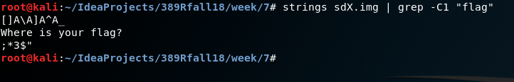
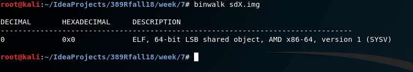
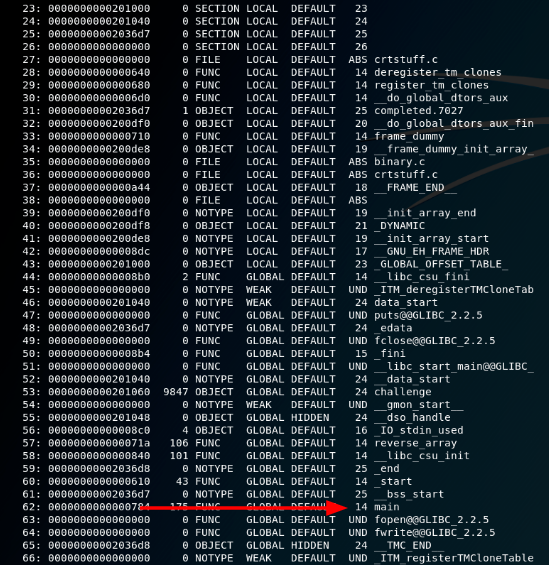
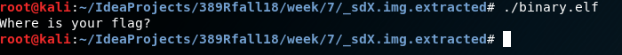
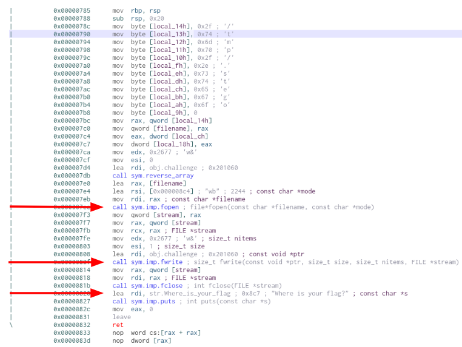
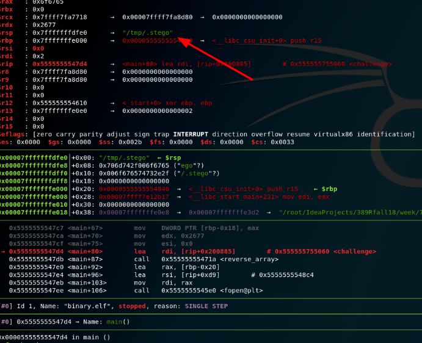

Writeup 7 - Forensics I
======

Name: *Kate Mann*
Section: *0101*

I pledge on my honor that I have not given or received any unauthorized assistance on this assignment or examination.

Digital acknowledgement of honor pledge: *Kate Mann*

## Assignment 7 writeup

### Part 1 (40 pts)

1. JPEG, jpg

2. Chicago, Illinois, USA : John Hancock Building/Center

3. Time: 2018:08:22 16:33:24Z

4. Apple iPhone 8 Back camera : 3.99MM f/1.8

5. 540 meters (1,7770 feet)

6. 
* `CMSC389R-{look_I_f0und_a_str1ng}` Found by doing a hexdump of the image. Also, could have used the 
strings command `strings image | grep -C1 "CMSC"`
*  `CMSC389R-{abr@cadabra}` Found by using `binwalk image` which showed that there was also a png file 
associated with the JPEG file. Using `binwalk --dd="png:png" image` extracted the picture and showed the
flag. 

### Part 2 (55 pts)
The first thing I did when looking at this file was to go through the steps listed in the Forensics 
lecture. I ran the command `sudo dd if=binary of =sdX.img bs=4M`. This created a copy of the binary file so that
I could work on it without ruining the original. I also ran `sha512sum sdX.img` mostly to see what this did to 
the file and get practice working with this command. 

Now it was time to start trying to find the flag. The first thing I tried was running the command
`strings sdX.img | grep -C1 "flag"`. 

I should have known that this would have been too easy. However, it did make me realize that I was on the correct
path. After this, It was time to explore binwalk. The first command I ran was `binwalk sdX.img` to figure out 
what type of file I was working with. 

Apparently, this was a x86-64 ELF file. The first thing I had to do at this point was research what
ELF files were. Apparently, they are Executed and Linkable Format files which is a standard file format for 
executables typically used for System V operating systems thanks to [Good Ole' Wikipedia](https://en.wikipedia.org/wiki/Executable_and_Linkable_Format)
Well, this was definitely the correct direction, since we had already used this in class. At this point, it was 
time to extract the ELF file from binary. This was done by using `binwalk --dd="elf:elf sdX.img`. This created
a new folder within the directory called `_sdx.img.extracted` which contiained a file called 0.elf. 

Having the file with the correct extension left me wondering where I went from here. First thing I decided to try
was hexdump. Maybe it would turn out something interesting. It didn't. At this point, I thought it prudent 
to explore the command `readelf`. This seemed like a sure bet. After running `readelf -a 0.elf`, I 
learned the various methods contained with the file, including the main method. 

Where there is a main method, there is a file to run however, the question was, how to make it run. After some 
digging around online trying to find a way to run a .elf file, I stumbled upon chmod after a while. I 
decided to create a copy of the .elf file first before using chmod, just in case. I named this new file 
binary.elf. I then ran `chmod +x binary.elf`. Bingo! I was then able to run the file through the command line. 

Well that obviously wasn't the flag and at this point I was wondering myself where the flag was. Since I could
actually run the file now, it was time to start delving into the program pieces. I decided to use cutter for this 
mostly because I have never used it before and wanted to see what it could do. This was definitely the right choice. 
After opening the file, cutter broke out every method into different sections that you could click on to 
view the assembly code. In the main method's assembly a few interesting things were shown. 

  

Knowing that the program was opening a file and writing to it begged the question of where was this "file". This was 
a job for my old friend gdb and it did not disappoint. It looked like the file was being written to the 
tmp folder. 

After going to the tmp directory I tried to just click and open the file. This didn't work because the system
did not know what the file type was. I then used binwalk to determine the correct file type. `binwalk .stego`
showed me that this was a JPEG file. Then I extracted the file into the correct format by using
`binwalk --dd="jpeg:jpeg`. Moving into the extracted files directory, `_.stego.extracted` I was finally able
to open and view the picture. While I don't know anything about dinosaurs, I took an educated guess that this 
was a stegosaurus. Then it was time to break out the stegonography tools. Running 
`steghide extract -sf 1.jpeg -xf out.txt` prompted me for a passphrase. Taking my educated guess of 
stegosaurus I decided to give that a try. This was successful on the first try! Finally the flag was found. 
`CMSC389R-{dropping_files_is_fun}`

