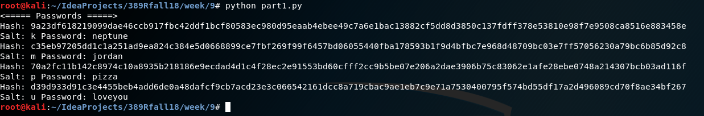
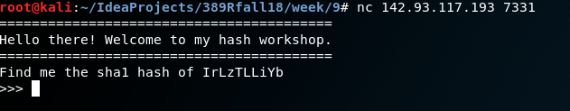
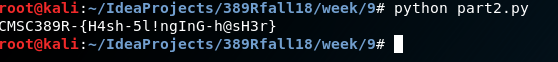

Writeup 9 - Crypto I
=====

Name: *Kate Mann*
Section: *0101*

I pledge on my honor that I have not given or received anyunauthorized assistance on this assignment or examination.

Digital acknowledgement of honor pledge: *Kate Mann*

## Assignment 9 Writeup

### Part 1 (60 Pts)
The first thing I did when tackling this assignment was to reread the crypto slides to determine a good place to start. 
After rereading that, it was time to delve into the Python library hashlib and read through it to give some insight.
After reading through the library I decided it would be prudent to google some examples of using the hashlibrary.
Once I read through the documentation, it was time to take a crack at part1.py. 

Looping through the salts was already provided so the next item to create were the loops through the passwords and 
hashes. Once I got the loops set up, it was time to create the salted password and send it through 
`shalib.sha512().hexdigest()` to get the guessed digest for checking against the stolen hashes. 

Running the code the first time did not return any results. It took me a while to figure out that the password list
contained newline characters at the end of the password. This newline was being factored into the hash so they needed
to be stripped out. After, stripping the newline from the end of the guessed password, I reran the code. This time
the code printed out: 

### Part 2 (40 Pts)

To get started on this portion of the assignment, I immediately tried the command `nc 142.93.117.193 7331` to see what
type of trivia it was asking. 

Looks like this is trivia where the answers are hashes. At this point, I went to `part2.py` and input the correct socket
information to get the socket to connect to the correct IP and port. After running just this part of the code, 
it was easy to see that I had to parse the SHA and password out of the returned string. 

I decided the easiest way to do this was through a regex. Splitting the string seemed like a lot of effort and I was 
worried that splitting it might miss pieces of the item to hash. This worked fairly well after figuring out the correct
regex's. Using [Pythex](https://pythex.org/) helped immensely in this endeavor. 

After getting the correct information out of the string, it was time to start sending the information through the 
correct hash function then through the socket. Getting the hash was simple after doing part 1 of this assignment.  
At first run of the program after sending the hashes through the socket the program hung. It took me a while to 
realize that this was because there was no newline at the end of the string. 

Finally, information kept coming and going through the socket. However, I realized that I forget to terminate the 
loop that was sending information so that I could finally see the flag. After fixing this issue, 
the flag was finally printed. 

